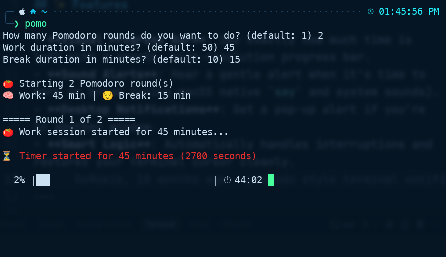

# 🍅 My Pomodoro Timer

> **Stay focused, work better.** A simple terminal-based timer for anyone who wants to crush their tasks without distractions.



---

## 🎯 Why use this?

Instead of opening a website or a bulky app, this timer lives right where you work—in your terminal. It shows a smooth progress bar, gives you a friendly nudge when it's time to break, and even speaks to you!

---

## 📥 Step 1: Get the files

First, you need to get these scripts onto your computer.

1.  **Download the folder:** Click the green **"Code"** button at the top of this page and select **"Download ZIP"**.
2.  **Unzip it:** Extract the files to a folder you can easily find (like your `Documents` or `Desktop`).
3.  **Open your Terminal:**
    - **Mac:** Press `Cmd + Space` and type "Terminal".
    - **Windows:** Right-click the Start button and choose "PowerShell" or "Terminal".

---

## 🍎 Step 2: Running on Mac or Linux

Follow these 3 easy steps:

1.  **Go to the folder:** Type `cd ` in your terminal (with a space), then drag the folder you unzipped into the terminal window and press **Enter**.
2.  **Give permission:** Copy and paste this command and press **Enter**:
    ```bash
    chmod +x pomo.zsh
    ```
3.  **Start the timer!** Type this and press **Enter**:
    ```bash
    ./pomo.zsh
    ```

> **Tip for Linux users:** If you want sound and notifications, run this first: `sudo apt install libnotify-bin speech-dispatcher`.

---

## 🪟 Step 2: Running on Windows

Windows needs one quick setup step first:

1.  **Go to the folder:** Type `cd ` in your terminal (with a space), then drag the folder you unzipped into the terminal window and press **Enter**.
2.  **Allow scripts:** Copy and paste this command and press **Enter** (you only need to do this once):
    ```powershell
    Set-ExecutionPolicy RemoteSigned -Scope CurrentUser
    ```
3.  **Start the timer!** Type this and press **Enter**:
    ```powershell
    ./pomo.ps1
    ```

---

## 🛠 How to Use It

Once you start the script, it will ask you three simple questions:

1.  **How many rounds?** (Example: `4`)
2.  **Work duration?** (Example: `25` minutes)
3.  **Break duration?** (Example: `5` minutes)

The timer will then start ticking! When the time is up, you'll hear a voice alert and see a notification.

---

## 🚀 Pro Tip: Use it anywhere!

Want to just type `pomo` from any folder?

### On Mac/Linux:

1. Open your terminal **inside** the project folder.
2. Run this command to see the exact line you need:
   ```bash
   echo "source $(pwd)/pomo.zsh"
   ```
3. Copy that output, open your settings (`nano ~/.zshrc`), and paste it at the very bottom!
4. Restart your terminal.

### On Windows:

1. Open PowerShell **inside** the project folder.
2. Run this command to see the exact line you need:
   ```powershell
   echo "function pomo { & \"$((Get-Item .).FullName)\pomo.ps1\" @args }"
   ```
3. Copy that output, open your settings (`notepad $PROFILE`), and paste it at the very bottom!
4. Restart your terminal.

### ✅ Where can I run it now?

Once you've done the "Pro Tip" steps above, **you are all set!**

- **Any Folder:** You don't have to go to the "Pomodoro" folder anymore. Whether you are in your project folder, your desktop, or your downloads—just type `pomo`.
- **Any New Window:** Every time you open a new Terminal or PowerShell window, the `pomo` command will be ready for you.

Just type `pomo` whenever you need to focus! 🚀

---

## 📜 Simple License

This project is open-source under the MIT License. Feel free to share it!
